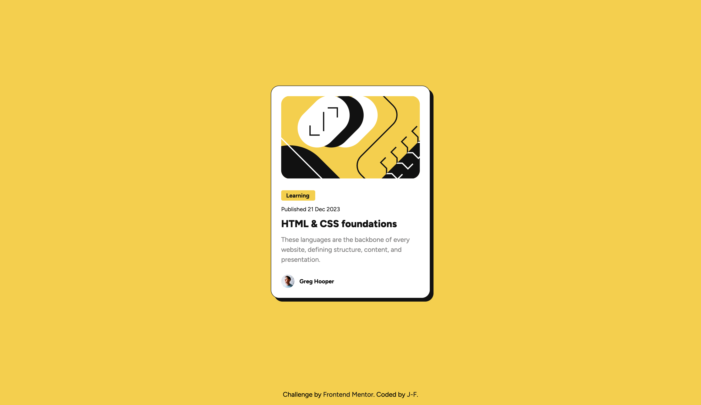
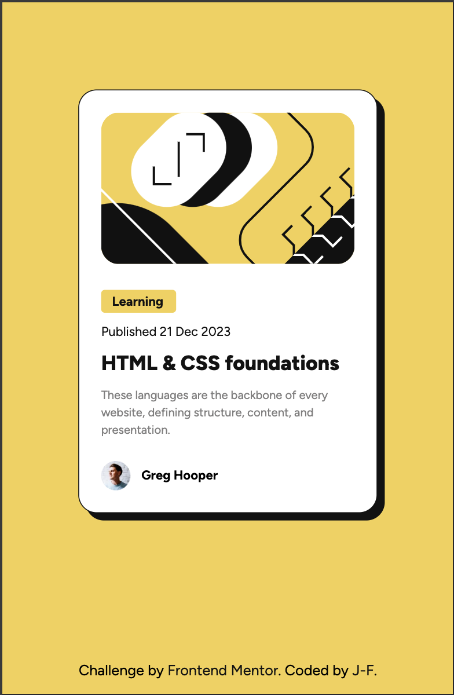

# Frontend Mentor - Blog preview card solution

This is a solution to the [Blog preview card challenge on Frontend Mentor](https://www.frontendmentor.io/challenges/blog-preview-card-ckPaj01IcS). Frontend Mentor challenges help you improve your coding skills by building realistic projects. 

## Table of contents

- [Overview](#overview)
  - [The challenge](#the-challenge)
  - [Screenshot](#screenshot)
  - [Links](#links)
- [My process](#my-process)
  - [Built with](#built-with)
  - [What I learned](#what-i-learned)
  - [Continued development](#continued-development)
  - [Useful resources](#useful-resources)
- [Author](#author)
- [Acknowledgments](#acknowledgments)


## Overview

### The challenge

Users should be able to:

- See hover and focus states for all interactive elements on the page

### Screenshot






### Links

- Solution URL: [My solution](https://github.com/JFGEER83/Blog-preview-card)
- Live Site URL: [My solution online](https://jfgeer83.github.io/Blog-preview-card/)

## My process

### Built with

- Semantic HTML5 markup
- CSS custom properties
- Flexbox
- CSS Variables 
- CSS Media queries

### What I learned

I learnt how to use css variables, how to use focus for links, css animations and media quieries to have a responsive element.

```css
:root{
    --main-bg-color:hsl(47, 88%, 63%);
    --main-color:hsl(0, 0%, 7%);
    --small-font-size: 0.875rem;
    --border-radius: 1.25rem;
    --margin-bottom: 0.75rem;
}
```
```css
 .title:focus{
   color: var(--main-bg-color);
 }
```

### Continued development
my aim is to use css variables in more detail in my projects, it's quite complete and very effective as a way of writing css, as well as being comfortable with media querries and being able to work with animations.


## Author

- Frontend Mentor - [@JFGEER83](https://www.frontendmentor.io/profile/JFGEER83)
- Twitter - [@JF46042899](https://twitter.com/JF46042899)

